Linear Regression
=================

Regression involves using one or more variables, labelled independent variables, to predict the values of another variable, the dependent variable. Variables that are strongly correlated with the dependent variable will be used for predicting that variable.

First, lets Install and load the requried packages.

``` r
install.packages('readr')
install.packages('ggplot2')
install.packages('mlbench')
install.packages('corrplot')
install.packages('Amelia')
install.packages('caret')
install.package('plotly')
install.packages('caTools')
install.packages('reshape2')
install.packages('dplyr')
```

``` r
library(readr)
library(ggplot2)
library(corrplot)
library(mlbench)
library(Amelia)
library(plotly)
library(reshape2)
library(caret)
library(caTools)
library(dplyr)
```

Boston Housing Dataset
----------------------

Housing data contains 506 census tracts of Boston from the 1970 census. The dataframe `BostonHousing` contains the original data by Harrison and Rubinfeld (1979), the dataframe BostonHousing2 the corrected version with additional spatial information.

You can include this data by installing `mlbench` library or download the dataset.The data has following features, `medv` being the target variable:

-   crim - per capita crime rate by town
-   zn - proportion of residential land zoned for lots over 25,000 sq.ft
-   indus - proportion of non-retail business acres per town
-   chas - Charles River dummy variable (= 1 if tract bounds river; 0 otherwise)
-   nox - nitric oxides concentration (parts per 10 million)
-   rm - average number of rooms per dwelling
-   age - proportion of owner-occupied units built prior to 1940
-   dis - weighted distances to five Boston employment centres
-   rad - index of accessibility to radial highways
-   tax - full-value property-tax rate per USD 10,000
-   ptratio- pupil-teacher ratio by town
-   b 1000(B - 0.63)^2, where B is the proportion of blacks by town
-   lstat - percentage of lower status of the population
-   medv - median value of owner-occupied homes in USD 1000's

Data
----

**Load the `BostonHousing` data and assign it to the variable `housing` . **

``` r
data(BostonHousing)
housing <- BostonHousing
str(housing)
```

    ## 'data.frame':    506 obs. of  14 variables:
    ##  $ crim   : num  0.00632 0.02731 0.02729 0.03237 0.06905 ...
    ##  $ zn     : num  18 0 0 0 0 0 12.5 12.5 12.5 12.5 ...
    ##  $ indus  : num  2.31 7.07 7.07 2.18 2.18 2.18 7.87 7.87 7.87 7.87 ...
    ##  $ chas   : Factor w/ 2 levels "0","1": 1 1 1 1 1 1 1 1 1 1 ...
    ##  $ nox    : num  0.538 0.469 0.469 0.458 0.458 0.458 0.524 0.524 0.524 0.524 ...
    ##  $ rm     : num  6.58 6.42 7.18 7 7.15 ...
    ##  $ age    : num  65.2 78.9 61.1 45.8 54.2 58.7 66.6 96.1 100 85.9 ...
    ##  $ dis    : num  4.09 4.97 4.97 6.06 6.06 ...
    ##  $ rad    : num  1 2 2 3 3 3 5 5 5 5 ...
    ##  $ tax    : num  296 242 242 222 222 222 311 311 311 311 ...
    ##  $ ptratio: num  15.3 17.8 17.8 18.7 18.7 18.7 15.2 15.2 15.2 15.2 ...
    ##  $ b      : num  397 397 393 395 397 ...
    ##  $ lstat  : num  4.98 9.14 4.03 2.94 5.33 ...
    ##  $ medv   : num  24 21.6 34.7 33.4 36.2 28.7 22.9 27.1 16.5 18.9 ...

Lets examine the `head` of the `housing` dataframe using `head()`.

``` r
head(housing)
```

    ##      crim zn indus chas   nox    rm  age    dis rad tax ptratio      b
    ## 1 0.00632 18  2.31    0 0.538 6.575 65.2 4.0900   1 296    15.3 396.90
    ## 2 0.02731  0  7.07    0 0.469 6.421 78.9 4.9671   2 242    17.8 396.90
    ## 3 0.02729  0  7.07    0 0.469 7.185 61.1 4.9671   2 242    17.8 392.83
    ## 4 0.03237  0  2.18    0 0.458 6.998 45.8 6.0622   3 222    18.7 394.63
    ## 5 0.06905  0  2.18    0 0.458 7.147 54.2 6.0622   3 222    18.7 396.90
    ## 6 0.02985  0  2.18    0 0.458 6.430 58.7 6.0622   3 222    18.7 394.12
    ##   lstat medv
    ## 1  4.98 24.0
    ## 2  9.14 21.6
    ## 3  4.03 34.7
    ## 4  2.94 33.4
    ## 5  5.33 36.2
    ## 6  5.21 28.7

``` r
summary(housing)
```

    ##       crim                zn             indus       chas   
    ##  Min.   : 0.00632   Min.   :  0.00   Min.   : 0.46   0:471  
    ##  1st Qu.: 0.08204   1st Qu.:  0.00   1st Qu.: 5.19   1: 35  
    ##  Median : 0.25651   Median :  0.00   Median : 9.69          
    ##  Mean   : 3.61352   Mean   : 11.36   Mean   :11.14          
    ##  3rd Qu.: 3.67708   3rd Qu.: 12.50   3rd Qu.:18.10          
    ##  Max.   :88.97620   Max.   :100.00   Max.   :27.74          
    ##       nox               rm             age              dis        
    ##  Min.   :0.3850   Min.   :3.561   Min.   :  2.90   Min.   : 1.130  
    ##  1st Qu.:0.4490   1st Qu.:5.886   1st Qu.: 45.02   1st Qu.: 2.100  
    ##  Median :0.5380   Median :6.208   Median : 77.50   Median : 3.207  
    ##  Mean   :0.5547   Mean   :6.285   Mean   : 68.57   Mean   : 3.795  
    ##  3rd Qu.:0.6240   3rd Qu.:6.623   3rd Qu.: 94.08   3rd Qu.: 5.188  
    ##  Max.   :0.8710   Max.   :8.780   Max.   :100.00   Max.   :12.127  
    ##       rad              tax           ptratio            b         
    ##  Min.   : 1.000   Min.   :187.0   Min.   :12.60   Min.   :  0.32  
    ##  1st Qu.: 4.000   1st Qu.:279.0   1st Qu.:17.40   1st Qu.:375.38  
    ##  Median : 5.000   Median :330.0   Median :19.05   Median :391.44  
    ##  Mean   : 9.549   Mean   :408.2   Mean   :18.46   Mean   :356.67  
    ##  3rd Qu.:24.000   3rd Qu.:666.0   3rd Qu.:20.20   3rd Qu.:396.23  
    ##  Max.   :24.000   Max.   :711.0   Max.   :22.00   Max.   :396.90  
    ##      lstat            medv      
    ##  Min.   : 1.73   Min.   : 5.00  
    ##  1st Qu.: 6.95   1st Qu.:17.02  
    ##  Median :11.36   Median :21.20  
    ##  Mean   :12.65   Mean   :22.53  
    ##  3rd Qu.:16.95   3rd Qu.:25.00  
    ##  Max.   :37.97   Max.   :50.00

Data Cleaning
-------------

Next we have to clean this data.There are many ways to do this. I will be using `missmap()` from `Amelia` package.

### Check for any NA's in the dataframe.

``` r
missmap(housing,col=c('yellow','black'),y.at=1,y.labels='',legend=TRUE)
```

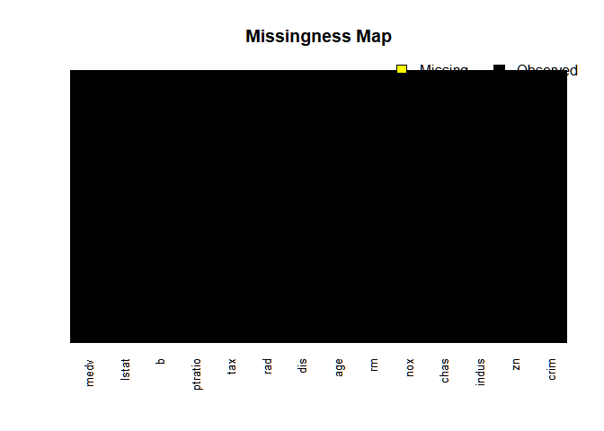

The above plot clearly shows that the data is free from NA's.

Exploratory Data Analysis
-------------------------

Let's use ggplot2,corrplot and plotly to explore the data a bit.

### Visualizations

#### Correlation

**Correlation and CorrPlots**

From Wikipedia, correlation is defined as:

In statistics, **dependence or association** is any statistical relationship, whether causal or not, between two random variables or two sets of data. Correlation is any of a broad class of statistical relationships involving dependence, though in common usage it most often refers to the extent to which two variables have a linear relationship with each other.

**Correlation** plots are a great way of exploring data and seeing if there are any interaction terms.

``` r
corrplot(cor(select(housing,-chas)))
```

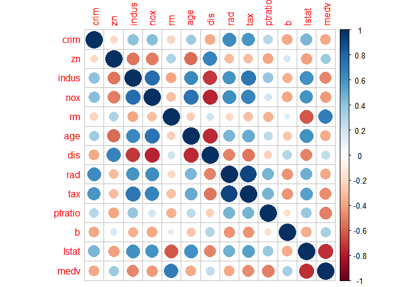

`medv` decreases with increase in `crim` (*medium*), `indus` (*High*),`nox`(*low*),`age`(*low*),`rad`(*low*),`tax`(*low*),`ptratio`(*high*), `lstat` (*High*) and increases with increase in `zn`(*low*),`rm`(*High*).

#### medv Density Plot using ggplot2

``` r
#visualizing the distribution of the target variable 

housing %>% 
  ggplot(aes(medv)) +
  stat_density() + 
  theme_bw()
```

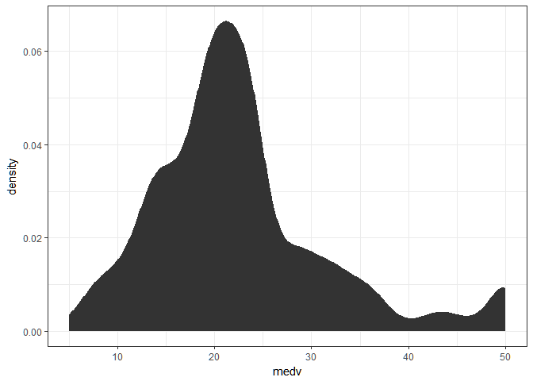 The above visualizations reveal that peak densities of `medv` are in between 15 and 30.

#### medv Density using plotly

``` r
ggplotly(housing %>% 
  ggplot(aes(medv)) +
  stat_density() + 
  theme_bw())
```

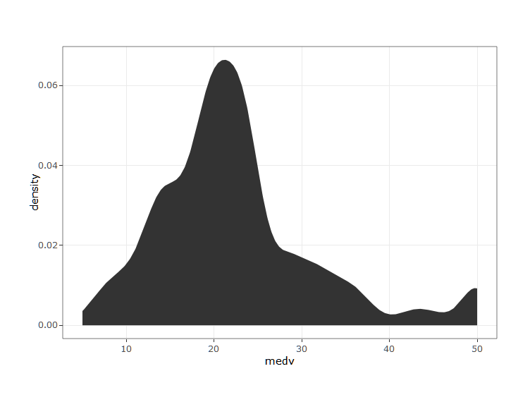

The above visualizations reveal that peak densities of `medv` are in between 15 and 30.

#### `medv`

Let's see the effect of the variables in the dataframe on `medv`.

``` r
housing %>%
  select(c(crim, rm, age, rad, tax, lstat, medv,indus,nox,ptratio,zn)) %>%
  melt(id.vars = "medv") %>%
  ggplot(aes(x = value, y = medv, colour = variable)) +
  geom_point(alpha = 0.7) +
  stat_smooth(aes(colour = "black")) +
  facet_wrap(~variable, scales = "free", ncol = 2) +
  labs(x = "Variable Value", y = "Median House Price ($1000s)") +
  theme_minimal()
```

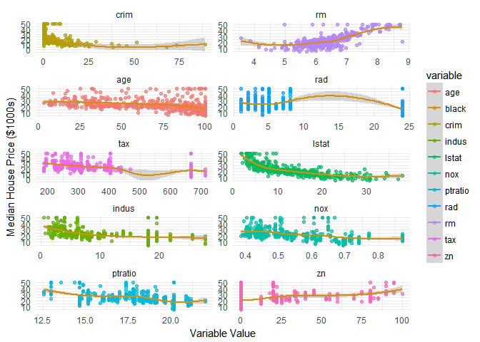

The results from the above graph are in correlation with the corrplot.

Model Building & Prediction
---------------------------

### General Form

The General Linear regression model in R :

Univariate Model : *m**o**d**e**l* &lt; −*l**m*(*y* ∼ *x*, *d**a**t**a*)

Multivariate Model : *m**o**d**e**l* &lt; −*l**m*(*y* ∼ ., *d**a**t**a*)

### Train and Test Data

Lets split the data into train and test data using `caTools` library.

``` r
#set a seed 
set.seed(123)

#Split the data , `split()` assigns a booleans to a new column based on the SplitRatio specified. 

split <- sample.split(housing,SplitRatio =0.75)


train <- subset(housing,split==TRUE)
test <- subset(housing,split==FALSE)

# train <- select(train,-b)
# test <- select(test,-b)
```

### Training our Model

Lets build our model considering that `crim`,`rm`,`tax`,`lstat` as the major influencers on the target variable.

``` r
model <- lm(medv ~ crim + rm + tax + lstat , data = train)
summary(model)
```

    ## 
    ## Call:
    ## lm(formula = medv ~ crim + rm + tax + lstat, data = train)
    ## 
    ## Residuals:
    ##     Min      1Q  Median      3Q     Max 
    ## -16.266  -3.185  -1.052   2.116  30.121 
    ## 
    ## Coefficients:
    ##              Estimate Std. Error t value Pr(>|t|)    
    ## (Intercept) -3.767079   3.573477  -1.054  0.29251    
    ## crim        -0.070793   0.037113  -1.908  0.05725 .  
    ## rm           5.580390   0.492854  11.323  < 2e-16 ***
    ## tax         -0.006392   0.002114  -3.023  0.00268 ** 
    ## lstat       -0.483836   0.058230  -8.309 2.04e-15 ***
    ## ---
    ## Signif. codes:  0 '***' 0.001 '**' 0.01 '*' 0.05 '.' 0.1 ' ' 1
    ## 
    ## Residual standard error: 5.183 on 357 degrees of freedom
    ## Multiple R-squared:  0.6816, Adjusted R-squared:  0.678 
    ## F-statistic: 191.1 on 4 and 357 DF,  p-value: < 2.2e-16

### Visualizing our Model

Lets visualize our linear regression model by plotting the residuals. The difference between the observed value of the **dependent variable** `(y)` and the **predicted value** `(y)` is called the **residual** `(e)`.

``` r
res <- residuals(model)

# Convert residuals to a DataFrame 

res <- as.data.frame(res)
```

``` r
ggplot(res,aes(res)) +  geom_histogram(fill='blue',alpha=0.5)
```

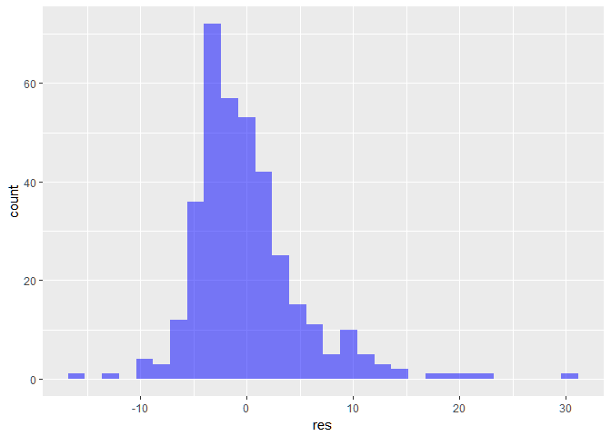

``` r
plot(model)
```

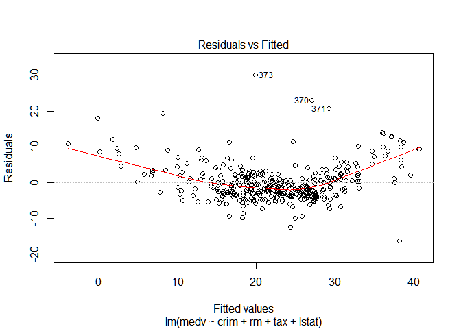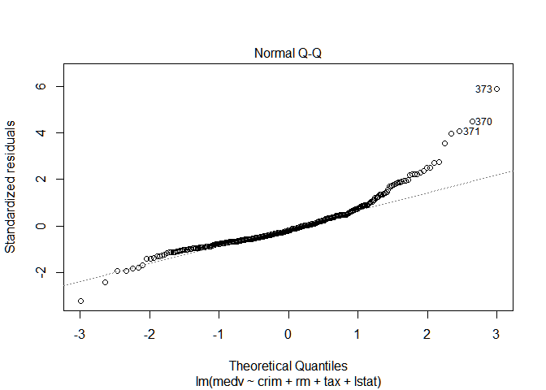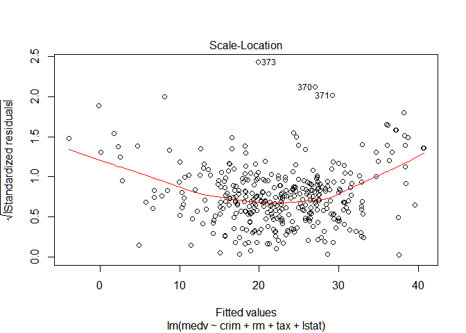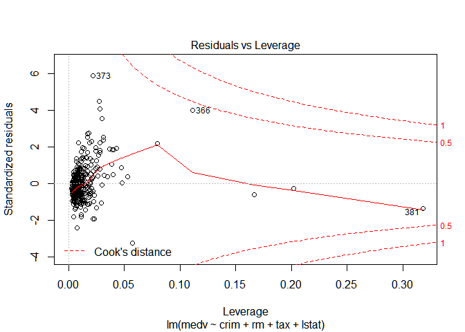

### Predictions

Let's test our model by predicting on our testing dataset.

``` r
test$predicted.medv <- predict(model,test)

pl1 <-test %>% 
  ggplot(aes(medv,predicted.medv)) +
  geom_point(alpha=0.5) + 
  stat_smooth(aes(colour='black')) +
  xlab('Actual value of medv') +
  ylab('Predicted value of medv')+
  theme_bw()

ggplotly(pl1)
```

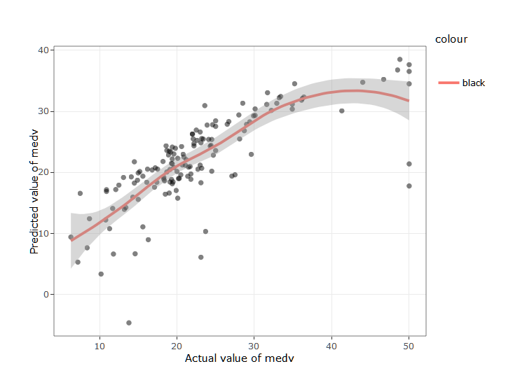

Lets evaluate our model using Root Mean Square Error, a standardized measure of how off we were with our predicted values.

### Assessing our Model

``` r
error <- test$medv-test$predicted.medv
rmse <- sqrt(mean(error^2))
```

The Root Mean Square Error (RMSE) for our Model is 0.7602882 and the Results can be further improved using feature extraction and rebuilding,training the model.
